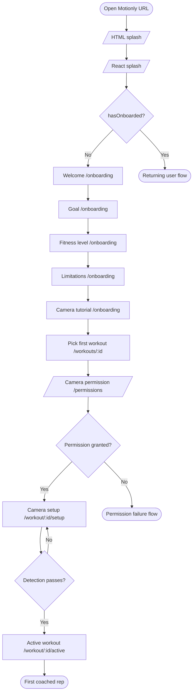

# Flow Diagrams

Mermaid renderings of the five user flows documented in [`../USER_FLOWS.md`](../USER_FLOWS.md). GitHub renders these inline. Each diagram is also stand-alone — you can copy and paste any block into [mermaid.live](https://mermaid.live) to iterate without needing the rest of this repo.

These diagrams are not implementation. They are visual companions to the narrative flows.

---

## A. First-time user

> **Target:** URL open → first coached rep in under 3 minutes.



---

## B. Returning user

> **Target:** PWA icon tap → continuing a workout in under 30 seconds.

```mermaid
flowchart TD
    A([Open Motionly icon / URL]) --> B[/Splash/]
    B --> C{hasOnboarded?}
    C -- No --> X([First-time flow])
    C -- Yes --> D[Dashboard /]
    D --> E{Choose intent}
    E -- Start today's workout --> F[/workout/:id/setup]
    E -- Explore --> G[/workouts]
    E -- Progress tab --> H[/progress]
    G --> I[/workouts/:id]
    I --> F
    F --> J{Detection passes?}
    J -- Yes --> K[/workout/:id/active]
    J -- No --> F
    K --> L[/workout/:id/summary]
    L --> D
```

---

## C. Subscription conversion

> **Goal:** Ethical conversion only. No urgency, no fake scarcity.

```mermaid
flowchart TD
    A[Free user] --> B{Hits Pro gate?}
    B -- Weekly limit --> C[/paywall]
    B -- Locked workout --> C
    B -- See plans /profile --> C
    B -- Upgrade banner --> C
    C --> D{User choice}
    D -- Dismiss --> E[Return to caller, no penalty]
    D -- Subscribe --> F[Provider checkout]
    F --> G{Outcome}
    G -- Success --> H[Webhook → entitlement updated]
    H --> I[Success screen]
    I --> J[Continue where caller intended]
    G -- Failure --> K[Paywall with retry banner]
    G -- Cancel --> C
    C --> L[Restore subscription link]
    L --> M{Entitlement found?}
    M -- Yes --> J
    M -- No --> N[Help: sign in with purchase email]
```

---

## D. Camera permission failure

> **Goal:** Calm, specific recovery. Never blame the user.

```mermaid
flowchart TD
    A[User starts a workout] --> B[/permissions explainer]
    B --> C[Browser asks for camera]
    C --> D{Outcome}
    D -- Granted --> E[/workout/:id/setup]
    D -- Soft denied --> F[/permissions denied state]
    F --> G[Try again CTA]
    G --> C
    D -- Hard denied --> H[/permissions browser-settings state]
    H --> I[User updates browser settings]
    I --> J[Reload after changing]
    J --> C
    D -- No camera --> K[Honest end state: no camera available]
    K --> L[Back to workouts]
    D -- Camera busy --> M[Close other camera apps]
    M --> C
    D -- Insecure context --> N[Open Motionly over HTTPS]
```

---

## E. Low-confidence AI

> **Goal:** When uncertain, the app stays silent on form and helps fix the setup.

```mermaid
flowchart TD
    A[/workout/:id/active] --> B[Pose pipeline emits landmarks]
    B --> C[Confidence aggregator]
    C --> D{Confidence >= threshold?}
    D -- Yes --> E[Form engine emits cues]
    E --> F[Cue card / voice]
    D -- No --> G[Suppress form cues]
    G --> H[Show system banner: setup guidance]
    H --> I{Confidence improved within 30s?}
    I -- Yes --> E
    I -- No --> J[Auto-pause + setup recovery overlay]
    J --> K[Back to /workout/:id/setup]
    K --> L[Resume from same set + rep]
```

---

## Related documents

- [`../USER_FLOWS.md`](../USER_FLOWS.md) — narrative flow descriptions.
- [`./README.md`](./README.md) — wireframes index.
- [`./00-design-principles.md`](./00-design-principles.md) — the UX principles every diagram must respect.
